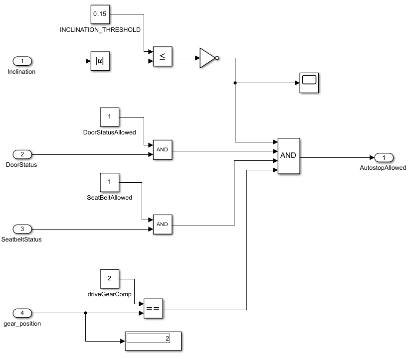
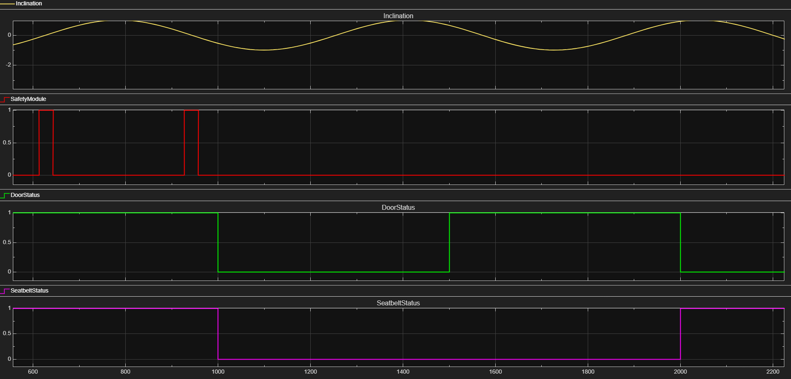

# Safety Module

This module is responsible for validating safety conditions before authorizing engine shutdown.

The image above demonstrates the signal response when varying the door, seat belt, and inclination signals.

## Features

- Validates door status
- Monitors seat belt engagement
- Checks vehicle inclination
- Ensures safe shutdown conditions