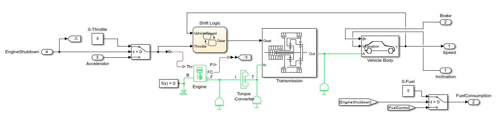
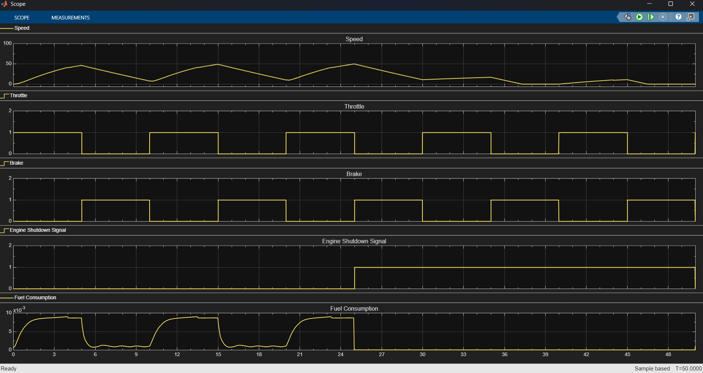

# Vehicle Model

This model is an adaptation of the 'Complete Vehicle Module' from Simscape. It has been customized to include inclination input and emission outputs.

## Adaptations

- **Inclination Input**: Added support for vehicle inclination as an input parameter
- **Emission Outputs**: Integrated emission measurement outputs for environmental analysis

## Features

- Complete vehicle dynamics simulation
- Real-time inclination sensing
- Emission tracking and reporting
- Simscape-based modeling